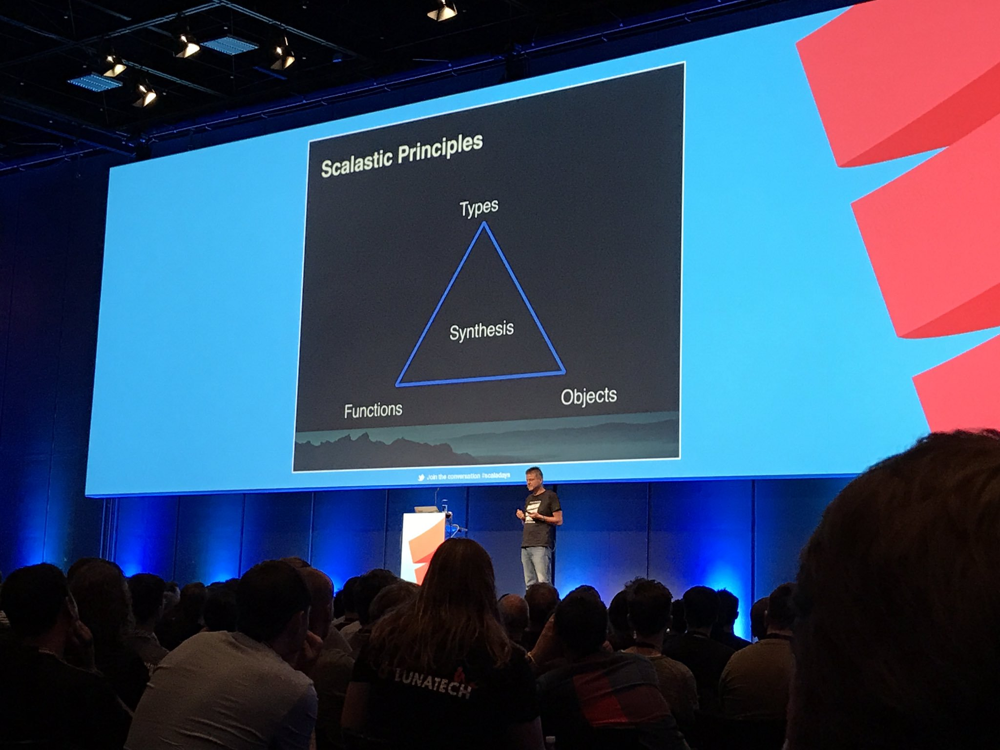
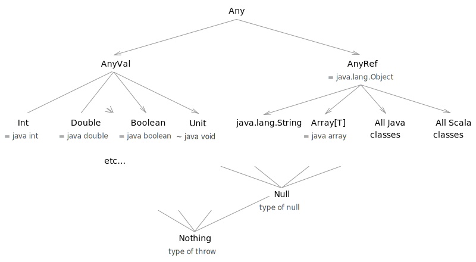

# Защо да учим Scala?

> A language that doesn't affect the way you think about programming is
> not worth knowing. --- Alan Perlis

# Принципи на Scala

{ height="520" }

# Влияния

::: incremental

- Обектно-ориентирани (Ruby/Smalltalk/Python)
- Функционални (ML, Haskell)
- Статично типизирани (ML, Haskell)
- JVM (Java)
- Конкурентни (Erlang)

:::

# Основни принципи

::: incremental
- Всичко е израз
- Изразите имат стойност и тип
- Типовете се декларират след идентификатора
- REPL (shell)

:::

# Литерали

- Int
- Boolean
- String
- Char

# Дефиниции

::: incremental

- Променливи – `var`
- променливи – `val`
- type inference
- функции – `def`

:::

# Незадължителни елементи

::: incremental

- ;
- .
- ()

:::

# Йерархия на типовете

# Основни типове

- Any
- AnyRef
- AnyVal
- Unit
- Null
- Nothing

# Контролни структури

::: incremental

- if
- while
- for
  - генератори
  - дефиниции
  - филтри

:::

# Операции на List, String, Range

::: incremental

- isEmpty
- length
- head
- tail
- take
- drop

:::

# Допълнителни ресурсиs

- [Essential Scala](https://underscore.io/books/essential-scala/)
- [API Docs](http://www.scala-lang.org/api/current/)
- <https://github.com/marconilanna/REPLesent>

# Упражнения

::: incremental

- Проверете дали един низ има балансирани скоби

:::
