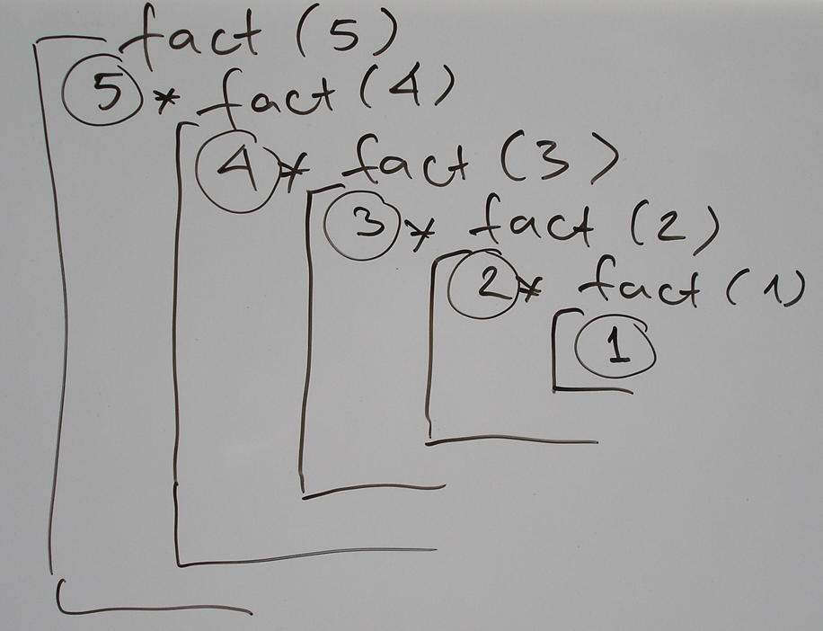
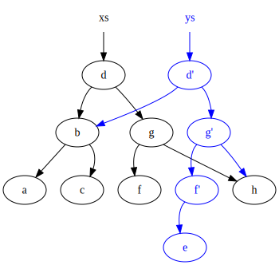
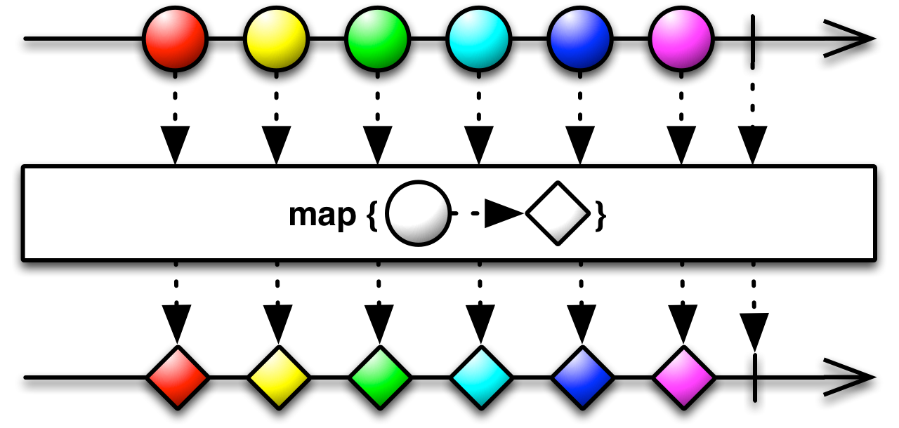
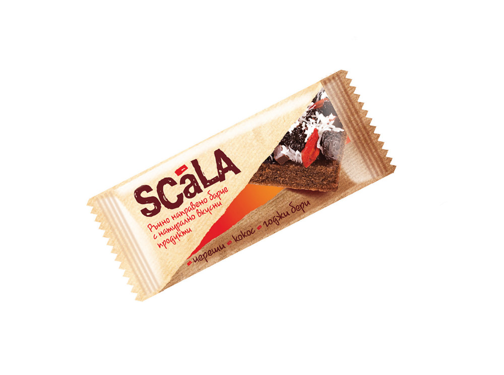

Scala- functional programming
=============================

:author: Vassil Dichev
:date: 13.03.2019

From OOP to FP
--------------
      Object-oriented programming makes code understandable by encapsulating moving parts. Functional programming makes code understandable by minimizing moving parts.

      -- Michael Feathers

Functions
---------

.. sidebar:: \

  .. image:: images/04-functional-programming-basics/function.png
      :class: scale
      :width: 375
      :height: 375
      :align: center

* Math: mapping inputs to outputs

* Programming: decompose and reuse

Functional programming
----------------------

* Referential transparency

* Functions as first-class

Referential transparency
------------------------

.. code-block:: scala

  val a = <expr>
  List(a, a)

  List(<expr>, <expr>)

Referential transparency
------------------------

.. code-block:: scala

  val a = 1 + 2
  List(a, a)

  List(1 + 2, 1 + 2)

Referential transparency
------------------------

.. code-block:: scala

  val a = println("TMTOWTDI")
  List(a, a)

  List(println("TMTOWTDI"), println("TMTOWTDI"))

Referential transparency
------------------------

.. code-block:: scala

  val a = i += 1
  List(a, a)

  List(i += 1, i += 1)

Referential transparency
------------------------

.. code-block:: scala

  val a = ???
  List(a, a)

  List(???, ???)

Referential transparency
------------------------

.. code-block:: scala

  val a = new MyObject
  List(a, a)

  List(new MyObject, new MyObject)

Pure functional programming
---------------------------

* Total: an output for every input.

* Deterministic: Same output for the same input.

* Pure: only effect is computing the output.

Life without mutation
---------------------

* Recursion

* Persistent data structures

* Local mutation

Recursion
---------

Tail recursion
--------------

* @tailrec

* accumulators

Immutability
------------

Classes should be immutable unless there's a very good reason to make them mutable

-- Joshua Bloch, Effective Java

Immutable objects are simple. Immutable objects are also safer. Immutable objects are always threads-safe.

-- Brian Goetz, Java Concurrency in Practice

Persistent data structures
--------------------------

Implement a tail-recursive function
-----------------------------------

* size: takes a list, returns size

* concat: takes 2 lists, returns concatenated list

* reverse: takes list, returns reversed list

Functions
---------

* Local functions

* Function literals

Higher-order functions
----------------------

Combinators are arguably the most reusable constructs we have in programming

-- Dean Wampler

* filter

* map

* foldLeft

filter
------

.. image:: images/04-functional-programming-basics/filter.png
    :class: scale
    :width: 640
    :height: 310

map
---

Syntax sugar
------------

Additional resources
--------------------

* `Scastie <https://scastie.scala-lang.org/>`_

* `Scala Fiddle <http://www.scala-js-fiddle.com/>`_

* `API Docs <http://www.scala-lang.org/api/current/>`_

* `Cube composer <http://david-peter.de/cube-composer/>`_

.. |date| date:: %d.%m.%Y
