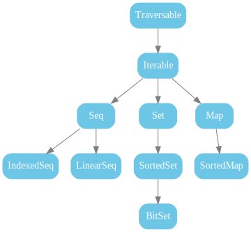

Scala- FP
=========

:author: Vassil Dichev

Curry
-----

Haskell Curry
-------------

.. image:: images/05-currying-tuples-collections/HaskellCurry.jpg
    :class: scale
    :width: 279
    :height: 343
    :align: center

Joke time
---------

  A team of functional programmers were wondering what to order for lunch.

  In the end they decided to order curry- it leads to fewer arguments.

What can these functions do?
----------------------------

.. code-block:: scala

  def f1[A](l: List[A]): Int

  def f2[A](l: List[A]): List[A]

reduce
------

.. image:: images/05-currying-tuples-collections/reduce.png
    :class: scale
    :width: 640
    :height: 320

Folding right or left
---------------------

.. image:: images/05-currying-tuples-collections/Right-fold-transformation.png
    :class: scale
    :width: 320
    :height: 158
    :align: center

.. image:: images/05-currying-tuples-collections/Left-fold-transformation.png
    :class: scale
    :width: 320
    :height: 158
    :align: center

Lazy
----

.. image:: images/05-currying-tuples-collections/work.png
    :class: scale
    :width: 320
    :height: 262
    :align: center

Implement in terms of foldLeft
------------------------------

.. class:: incremental

* size

* max

* contains

* reverse

Tuple2
------

.. class:: incremental

* partition

* span

* splitAt

Collections
-----------

Imports
-------

* on-demand

* selector

* renaming

Functions
---------

.. class:: incremental

* flatten

* flatMap

* groupBy

* zip

.. |date| date:: %d.%m.%Y

Zip
---

