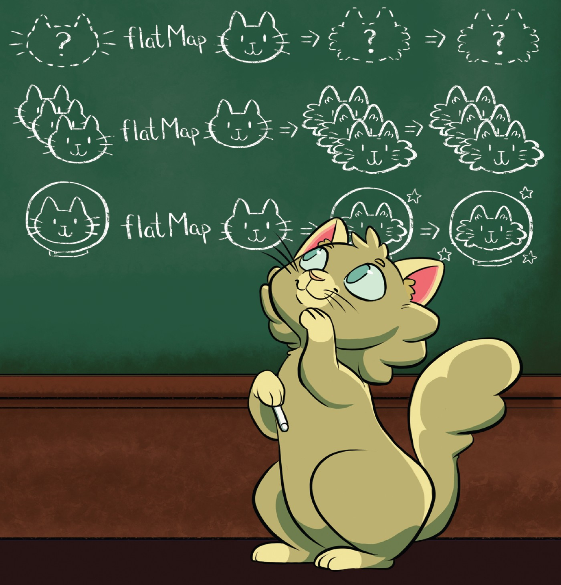
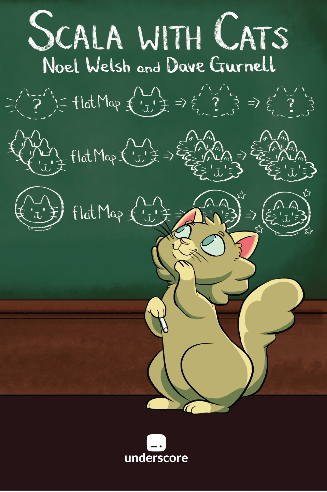

# Предния път – изрази

```scala
val a = 42 // независими
val b = 4  // изчисления

val c = a + b // операция
val d = (a + b) * 10 // композиция на операции
val e = f(g(a)) // композиция на функции
```

<p class="fragment">
Пренесохме възможността за тези операции върху ефекта `Future`<br/>
<span class="fragment">(и стойността в него)</span>
</p>

:::incremental

* `map` – трансформация на единична стойност (напр. `val c = -a`)
* `map2`, или още `zipMap` или `zipWith` – трансформация на две независими стойности (`val c = a + b`)<span class="fragment">. Резултатът `c` зависи от тях</span>
* `map3`, `zipMap3`...<span class="fragment">; `mapN` дефинира зависимости</span>
* `flatMap` – когато функциите в изразите са ефектни, напр. ако `f` и `g` връщат `Future`
* `flatMap` – ефектна трансформация на единична стойност

:::

# Референтна прозрачност на eager vs lazy Future-и

```scala
def calc[T](expr: => T) = Future {
  Thread.sleep(4000)

  expr
}
```

```scala
val futureA = calc(42)
val futureB = calc(10)

val sum = for {
  a <- futureA
  b <- futureB
} yield a + b

println {
  Await.result(sum, 5.seconds)
}
```

```
> 52
```

# Референтна прозрачност на eager vs lazy Future-и

```scala
val sum = for {
  a <- calc(42)
  b <- calc(10)
} yield a + b

println {
  Await.result(sum, 5.seconds)
}
```

```
> Exception in thread "main" java.util.concurrent.TimeoutException: Futures timed out after [5 seconds]
```

# Референтна прозрачност на eager vs lazy Future-и

```scala
val sum = for {
  (a, b) <- calc(42).zip(calc(10))
} yield a + b

println {
  Await.result(sum, 5.seconds)
}
```

```
> 52
```

<p class="fragment">Тук вече няма значение дали Future-а е eager или lazy</p>

# Абстрактност

# Абстрактността в математиката

<p class="fragment">Примери: групи, полета, полиноми, векторни пространства и много други</p>

<p class="fragment">Алгебрични структури – множества със съответни операции и аксиоми (свойства)</p>

<p class="fragment">алгебрични структури ~ тип данни</p>

# Група

Нека G е множество с бинарна операция „·“

G наричаме група, ако:

<div class="fragment">

* асоциативност – ∀ a, b, c ∈ G:
  
  ```
  (a · b) · c = a · (b · c)
  ```
* неутрален елемент – ∃ e ∈ G, такъв че ∀ a ∈ G
  
  ```
  e · a = a · e = a
  ```
* обратен елемент – ∀ a ∈ G, ∃ a' ∈ G, такъв че
  
  ```
  a · a' = a' · a = e
  ```
</div>

# Моноид

Нека M е множество с бинарна операция „·“

M наричаме моноид, ако:

* асоциативност – ∀ a, b, c ∈ M:
  
  ```
  (a · b) · c = a · (b · c)
  ```
* неутрален елемент – ∃ e ∈ M, такъв че ∀ a ∈ M
  
  ```
  e · a = a · e = a
  ```

# Реализация?

<div class="fragment">

Задача: напишете метод `sum` работещ с различни типове

```scala
def sum[A ???](xs: List[???]): A = ???

sum(List(1, 3, 4))
sum(List("a", "b", "c"))
sum(List(Rational(1, 2), Rational(3, 4)))
```

</div>

# Контекст в програмния код

<p class="fragment">в математиката: „Нека фиксираме поле F, такова че...“</p>
<p class="fragment">в математиката: „Нека фиксираме ортогонална координатна система“</p>

#

<dl>
    <dt>context</dt>
    <dd>1. The parts of a written or spoken statement that precede or follow a specific word or passage, usually influencing its meaning or effect;</dd>
    <dd class="fragment">2. The set of circumstances or facts that surround a particular event, statement, idea, etc.</dd>
    <dd class="fragment">3. “What comes with the text, but is not in the text.”</dd>
</dl>

# Примери

Текуща:

* конфигурация
* транзакция
* сесия
* ExecutionContext – pool от нишки
* ...

# Контекст в програмния код

* import
* подтипов полиморфизъм
* dependency injection
* външен scope
* параметри

#

Експлицитно предаване на контекст

#

Имплицитно предаване на контекст

<p class="fragment">В Scala чрез implicts</p>

# Context bound

```scala
def sum[A : Monoid](xs: List[A])
```

#

Type class-овете дефинират операции и аксиоми/свойства, които даден тип трябва да притежава.

<p class="fragment">За да бъде един тип от даден клас, то трябва да предоставим валидна имплементация на операциите на type class-а</p>

# Аксиомите са важни

((a · b) · c) · d – едно по едно, от ляво надясно

(a · b) · (c · d) – балансирано и паралелизуемо

<p class="fragment">Могат да бъдат проверявани чрез тестове</p>

# `fold` vs `foldLeft`

```scala
(1 to 100000000).par.fold(0)(_ + _)
```

<p class="fragment">`fold` изисква асоциативна операция</p>

# ООП класове срещу type class-ове

<p class="fragment">Класовете в ООП моделират обекти</p>

<p class="fragment">Type class-овете моделират типове</p>

# Полиморфизъм

<p class="fragment">Използването на един и същи интерфейс с различни типове</p>

# Параметричен полиморфизъм (generics)

```scala
def mapTwice[A](xs: List[A])(f: A => A): List[A] =
  xs.map(f compose f)

mapTwice(List(1, 2, 3)(_ * 2))
mapTwice(List("ab", "c", "def")(str => str + str))
```

# Ad hoc полиморфизъм

Избор на конкретна имплементация според конкретния тип

# Ad hoc полиморфизъм – overloading

```scala
def stringify(n: Int) = n.toString
def stringify(n: Rational) = s"$n.numer/$n.denom"

stringify(1) // "1"
stringify(Rational(1)) // "1/1"
```

# Ad hoc полиморфизъм – type classes

Пример: реализацията на <code>Monoid</code> се избира конкретно според типа

```scala
sum(List(Rational(2), Rational(4))) // rationalMonoid
sum(List(2, 4)) // intMonoid
```

# Подтипов полиморфизъм

```scala
trait Figure {
  def area: Double
  def circumference: Double
}

case class Circle(radius: Double) extends Figure {
  def area: Double = Pi * radius * radius
  def circumference: Double = 2 * Pi * radius
}

case class Square(side: Double) extends Figure {
  def area: Double = side * side
  def circumference: Double = 4 * side
}

val figure = getRandomFigure(10)
figure.area // 100
```

<p class="fragment">Липсва информация за конкретния тип, но се изпълнява конкретна имплементация</p>

# Duck typing и структурно подтипизиране

```scala
type Closable = { def close(): Unit }

def handle[A <: Closable, B](resource: A)(f: A => B): B =
  try f(resource) finally resource.close()

handle(new FileReader("file.txt"))(f => readLines(f))
```

# Binding

<div class="fragment">

* Static (compile time) – параметричен и ad-hoc полиморфизъм
* Late (runtime) – подтипов полиморфизъм и duck typing

</div>

<p class="fragment">Late binding-а е фундаментален за ООП</p>

#

<blockquote>
“I thought of objects being like biological cells and/or individual computers on a network, only able to communicate with messages... to communicate with messages...
OOP to me means only messaging, local retention and protection and hiding of state-process, and extreme late-binding of all things.”
― Alan Kay
</blockquote>

# Ретроактивност

разширяване на тип без промяна на кода му

# Ретроактивен полиморфизъм

добавяне на интерфейс към тип<br />без промяна на кода му

<p class="fragment">Type class-овете поддържат ретроактивен полиморфизъм</p>

# Numeric

# Ordering

# Сериализация до JSON

# Логически изводи в типовата система

<p class="fragment">Типовата система е логическа и търсенето на implicit стойности, отговарящи на определен тип, съвпада с механиката на изводите, познати ни от логическото програмиране</p>

# Type class-ове за допълнителна информация. Compile-time type metadata

* `ClassTag` – информация за класа на подадения тип 
* `TypeTag` – пълна типова информация, включително за generic параметрите 

# Езици, поддържащи type class-ове

* Haskell
* Scala
* [Rust](https://rustbyexample.com/trait.html)
* Idris
* ...

#

В Haskell всеки type class може да има само една инстанция за определен тип.

В Scala липсва такова ограничение, което е едновременно и плюс и минус.

# Библиотеки за type class-ове?

{ height="520" }

# Библиотеки

* [{ height="40" style="vertical-align: middle" } Cats](http://typelevel.org/cats/)
* [Spire](https://typelevel.org/spire/) – математически абстракции, използва Cats
* [Scalaz](https://scalaz.github.io)

# Cats

# Multiversal equality (`Eq`)

# Scala with Cats

[{ height="520" }](https://underscore.io/books/scala-with-cats/)

# Spire – Линейно пространство

Type class-ове на повече типове

<p class="fragment">Дефинират type class релация между няколко типа</p>

# В заключение

Type class-овете:

:::incremental

* моделират типове
* предоставят общ интерфейс и аксиоми за цяло множество от типове
* или още – общ език, чрез който да мислим и боравим с тези типове
* позволяват ad hoc полиморфизъм
* наблягат на композитността и декларативността
* не изискват промяна на кода на типа и в Scala могат да бъдат контекстно-зависими

:::