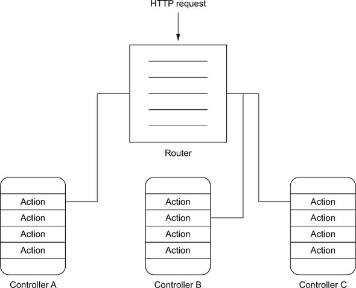

#

Функционалните програми се състоят в голяма степен от чисти функции без състояние

Как да ги организираме в нашия код?

#

Чистите функции често рефирират към други конкретни функции.

```scala
def function(xs: List[String], n: Int) = {
  xs.zipWithIndex.map {
    case (x, index) => ObjectA.anotherFunction(x, index % n)
  }
}
```

#

В някои случаи, особено при работа с конкретен домейн, е доста вероятно да искаме да се абстрахираме от конкретната имплементация на функциите, от които зависим

#

Във ФП това може да постигнем като функцията се подава като параметър:

```scala
def function(meaningfulTransformation: (String, Int) => String)
            (xs: List[String], n: Int) = {
  xs.zipWithIndex.map {
    case (x, index) => meaningfulTransformation(x, index % n)
  }
}

val functionWithObjectA = function(ObjectA.anotherFunction)(_: List[String], _: Int)

functionWithObjectA(List("a", "bc", "def"), 11)

```

# Dependency injection

Този подход наричаме със сложното име "Dependency injection"

<p class="fragment">Представлява вид inversion of control – поради това, че функцията вече не създава/реферира изрично своята зависимост, ами я приема като параметър</p>

# Dependency injection с ООП модулност

:::incremental

* Този подход работи добре, но може да направи функциите доста сложни
* В Scala можем да използваме ООП класовете и trait-овете за да решим това

:::

# Dependency injection с ООП модулност

```scala
class SomeClass(meaningfulTransformation: (String, Int) => String) {
  def function(xs: List[String], n: Int) = {
    xs.zipWithIndex.map {
      case (x, index) => meaningfulTransformation(x, index % n)
    }
  }
  
  def anotherFunction = ???
}

val someObject = new SomeClass(ObjectA.anotherFunction)

someObject.functionWithObjectA(List("a", "bc", "def"), 11)
```

# Dependency injection с ООП модулност

```scala
class SomeClass(meaningfulTransformation: MeaningfulTransformation) {
  def function(xs: List[String], n: Int) = {
    xs.zipWithIndex.map {
      case (x, index) => meaningfulTransformation(x, index % n)
    }
  }
  
  def anotherFunction = ???
}

val someObject = new SomeClass(ObjectA.anotherFunction)

someObject.functionWithObjectA(List("a", "bc", "def"), 11)
```

```scala
trait MeaningfulTransformation {
  def apply(str: String, n: Int): String
}
```

# Защо dependency injection?

:::incremental

* less coupling, more flexibility
* не сме зависими от конкретна имплементация (която може да се промени)
* позволява тестване – подменяме зависимостите със специално подбрани инстанции
* става ясно от какво всъщност зависи определен компонент

:::

# Dependency injection – кой навързва зависимостите?

:::incremental

* Runtime – популярно в Java света ([Guice](https://github.com/google/guice), [Spring](https://spring.io/))<span class="fragment">. Не бива валидирано по време на компилация</span>
* Compile-time

:::

# Compile-time dependency injection – демо

# Thin cake pattern

# Runtime конфигурация

# Повече информация

[DI in Scala guide](https://di-in-scala.github.io/)

# Изразителност на функционалното програмиране

:::incremental

* Основна полза на функционалното програмиране е възможността за абстрактност
* Но най-силно изразителността му се проличава когато добавим конкретика и опитаме да моделираме конкретен домейн
* Често създаваме конкретни функционални DSL/библиотека за определен домейн
* Но много техни аспекти моделираме срещу познати ни абстракции, като моноид, монада, апликатив и т.н.

:::

# Домейн: Web и HTTP

# HTTP библиотеки за Scala (с допълнения)

:::incremental

* [cats](https://typelevel.org/cats/) + [http4s](https://http4s.org/) + [circle](https://circe.github.io/circe/) + [doobie](https://tpolecat.github.io/doobie/)
* [Akka HTTP](https://doc.akka.io/docs/akka-http/current/index.html)
* [Play Framework](https://www.playframework.com/) (a bit opinionated)

:::

# Play Framework

# HTTP app


# Action

Обработва request до HTTP response

# Action

```scala
trait EssentialAction extends RequestHeader => Accumulator[ByteString, Result]
```

# HTTP app



# Json

```scala
trait Writes[-A] {
  def writes(o: A): JsValue
}
```

<div class="fragment">

```scala
trait Reads[A] {
  def reads(json: JsValue): JsResult[A]
}
```

</div>

<div class="fragment">

```scala
sealed trait JsResult[+A]
case class JsSuccess[T](value: T, path: JsPath = JsPath()) extends JsResult[T]
case class JsError(errors: collection.Seq[(JsPath, collection.Seq[JsonValidationError])]) extends JsResult[Nothing]
```

</div>

<div class="fragment">

```scala
trait Format[A] extends Writes[A] with Reads[A]
```

</div>

# Body parsing

# Shopping Cart
