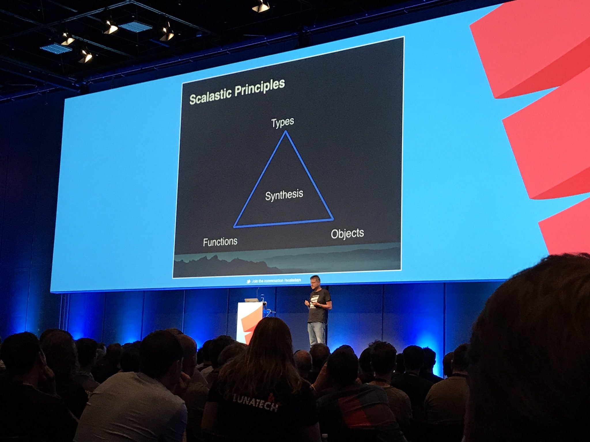

Въведение в езика Scala
=======================

:author: Васил Дичев
:date: |date|

Защо да учим Scala?
-------------------
      A language that doesn’t affect the way you think about programming is not worth knowing. — Alan Perlis
    

Принципи на Scala
-----------------

Влияния
-------

.. class:: incremental

* Обектно-ориентирани (Ruby/Smalltalk/Python)

* Функционални (ML, Haskell)

* Статично типизирани (ML, Haskell)

* JVM (Java)

* Конкурентни (Erlang)

Основни принципи
----------------

.. class:: incremental

* Всичко е израз

* Изразите имат стойност и тип

* Типовете се декларират след идентификатора

* REPL (shell)

Литерали
--------

* Int

* Boolean

* String

* Char

Дефиниции
---------

.. class:: incremental

* Променливи- var

* променливи- val

* type inference

* функции- def

Незадължителни елементи
-----------------------

.. class:: incremental

* ;

* .

* ()

Йерархия на типовете
--------------------

.. image:: images/scala_type_hierarchy.svg
    :class: scale
    :width: 1000
    :height: 550
    :align: center

Основни типове
--------------

* Any

* AnyRef

* AnyVal

* Unit

* Null

* Nothing

Контролни структури
-------------------

.. class:: incremental

* if

* while

* for

  * генератори

  * дефиниции

  * филтри

Операции на List, String, Range
-------------------------------

.. class:: incremental

* isEmpty

* length

* head

* tail

* take

* drop

Допълнителни ресурси
--------------------

* `Essential Scala <https://underscore.io/books/essential-scala/>`_

* `API Docs <http://www.scala-lang.org/api/current/>`_

* `https://github.com/marconilanna/REPLesent <https://github.com/marconilanna/REPLesent>`_

Упражнения
----------

.. class:: incremental

* Проверете дали един низ има балансирани скоби

.. |date| date:: %d.%m.%Y